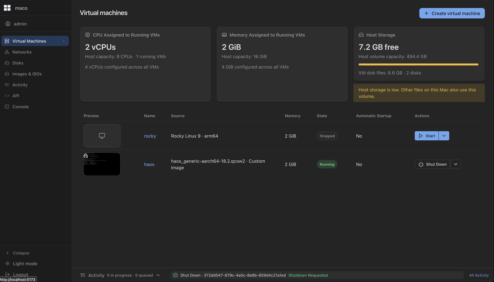
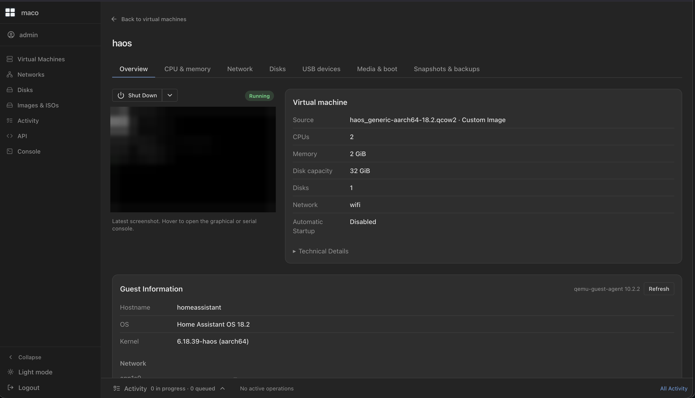
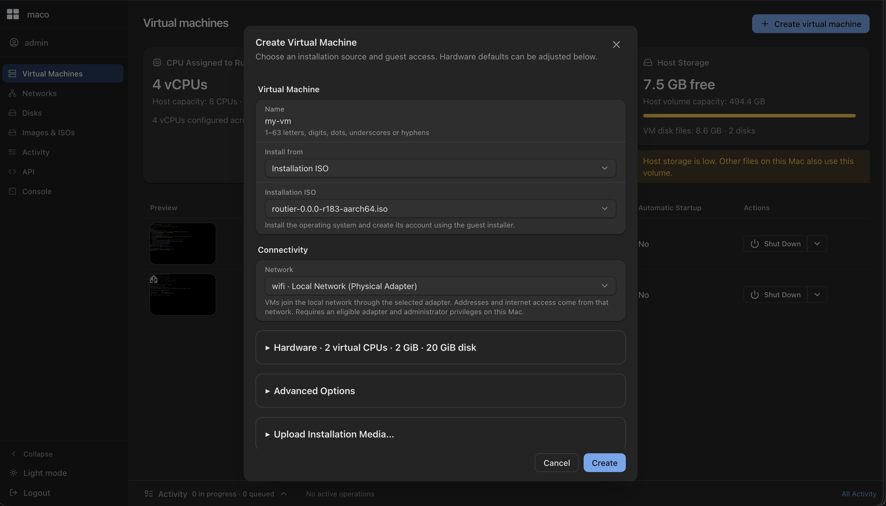
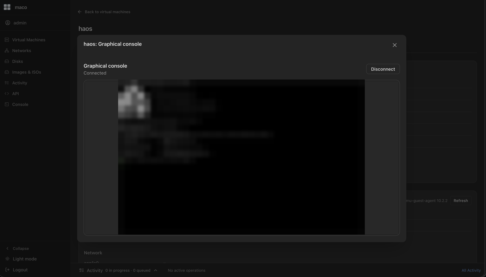
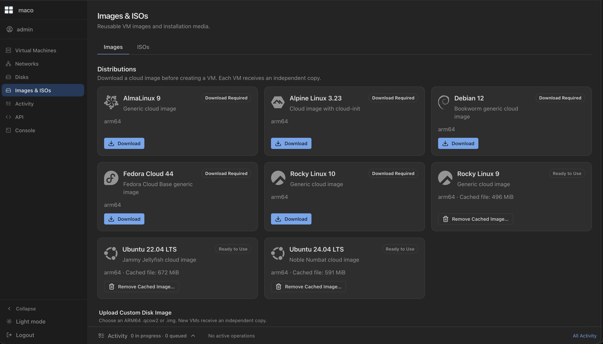

# maco

A lightweight VMM for macOS on Apple Silicon. You describe the virtual machines
you want in YAML, and maco reconciles the running system to match: it starts,
restarts, and destroys QEMU virtual machines accelerated by Apple's
Hypervisor.framework. A CLI, an HTTP API, and a web UI all drive the same
engine, so nothing you can do in one is missing from the others.



## Requirements

- macOS on Apple Silicon (arm64).
- [QEMU](https://www.qemu.org/) with the Hypervisor.framework entitlement,
  which Homebrew's build provides.
- Redis, only when you run the web UI and API.

```bash
brew install qemu pkg-config libusb
codesign -d --entitlements - "$(which qemu-system-aarch64)" | grep hypervisor
```

The `grep hypervisor` line should print an entitlement. If it prints nothing,
QEMU cannot use HVF and VMs will not boot.

## Build

```bash
make build
```

This produces the `maco` binary and the native `maco-net-helper` in the repo
root.

## Boot your first VM

```bash
./maco image pull ubuntu-24.04-arm64
./maco vm new web1 --cpus 2 --memory 2048
./maco vm start web1
./maco vm list
```

`vm new` writes a YAML manifest and mints a uuid; `vm start` boots it under HVF.
The default login is user `maco`, password `maco`, reachable over user-mode NAT.
Attach to the serial console, then detach with `Ctrl+A` `Q` while the VM keeps
running:

```bash
./maco vm console web1
```

Stop or delete it when you are done:

```bash
./maco vm stop web1
./maco vm destroy web1
```

The data directory defaults to `~/Library/Application Support/maco` (override
with `--data-dir` or `MACO_DATA_DIR`). Manifests there are the source of truth;
the SQLite cache is always rebuildable from them.

## Run the web UI and API

Build the binary with the UI embedded, start Redis, and serve:

```bash
make build-ui
brew services start redis
MACO_ADMIN_PASSWORD=changeme ./maco serve --addr :8080
```

On first run maco creates an `admin` account from `MACO_ADMIN_PASSWORD` (or logs
a generated password once), then serves over HTTPS with a self-signed
certificate. Open https://localhost:8080 and log in. Accounts live in the SQLite
database with bcrypt hashes; there is no dependency on unix accounts.

To run maco as a launchd system daemon that reconciles `autostart` VMs on boot
and manages a companion Redis, see [docs/install.md](docs/install.md).

## Screenshots

| VM details | Create a VM |
|------------|-------------|
|  |  |





## Documentation

Full documentation lives in [docs/](docs/README.md), including the
[CLI reference](docs/cli.md), the [VM manifest model](docs/configuration.md),
[network modes](docs/network-modes.md), [authentication](docs/authentication.md),
and the [architecture](docs/architecture.md).

maco is built around a declarative manifest and reconcile pipeline: you
describe the VMs you want, and maco converges the running system to match.

## AI Slop

As AI usage keeps increasing everywhere, this project is probably the most AI-clanked one I've worked on, but that was actually the goal. I wanted to see if I could work on something "big" that could genuinely make my life easier.

To be totally transparent, I think I worked for around 10 hours straight on this project. About 10% of that time was spent debugging and trying to understand why the AI was doing some weird shit, and the other 90% was testing and basically doing QA on the code it wrote.

That's quite impressive, but I truly believe AI is still just a tool that writes the code while following the owner's vision of the project. I'm very careful about how the UI should look and which features I need or want, without giving too much freedom to the AI. On this project, though, my role definitely changed. Instead of writing most of the code myself, I was more like a manager, keeping the whole project in mind, making the decisions, and making sure the implementation actually matched what I wanted.

Is that bad? Well, I don't know yet.

I don't think I could have written this project from scratch in such a short amount of time, and the code could 100% have been worse than what I ended up with.

The project itself isn't actually that complicated. It's basically calling external tools like QEMU, communicating over sockets, handling HTTP/WebSocket APIs, and requiring some networking knowledge, specifically understanding how macOS networking works and what you can do with it (the veth pair + BPF helper, for example).

So yes, you can consider this project AI slop. But it's also what actually powers my Mac mini server running VMs in my homelab. It's useful, it works, and considering it took around 10 hours to build, I think that's mooooore than a success, IMO.

