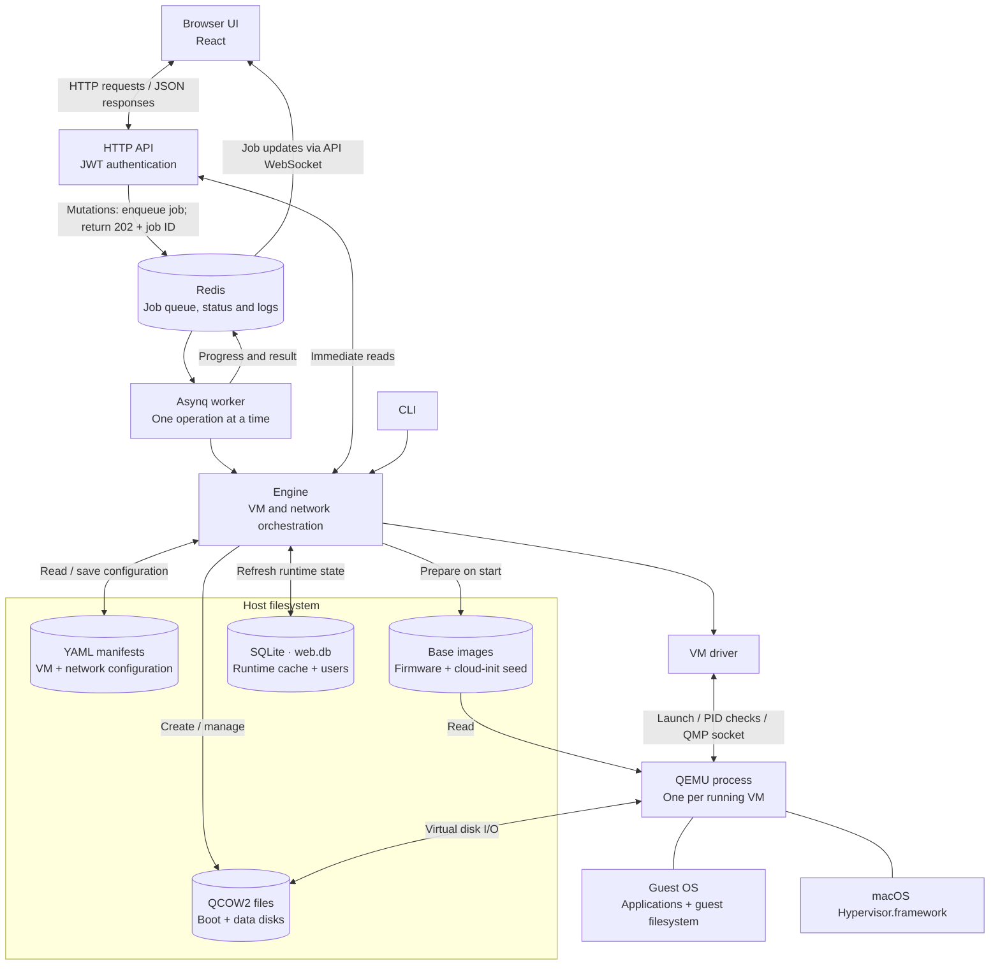
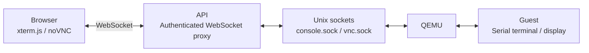

# UI, API, QEMU and filesystem flow

Current architecture, verified against the implementation on 2026-09-14.

## Live console path

- **Start:** API queues a job; worker calls the engine; engine reads YAML and prepares disks; driver launches QEMU; job updates reach the UI.
- **Guest file write:** guest filesystem → virtual disk controller → QEMU → host QCOW2 file. The UI/API are outside this data path.
- **Persistence:** YAML stores configuration; SQLite caches VM runtime state and stores users; Redis stores jobs and their logs. Only the runtime cache portion of SQLite is rebuildable.
- **Runtime files:** QMP, serial and VNC sockets, PID files, logs and previews live under `/tmp/maco-<hash>/<uuid>/`.

Implementation: `pkg/engine/vm.go`, `pkg/jobs/jobs.go`, `pkg/vm/qemu.go`, `pkg/api/console.go`. See [architecture](../architecture.md) and the proposed [USB passthrough plan](usb-passthrough-plan.md).
