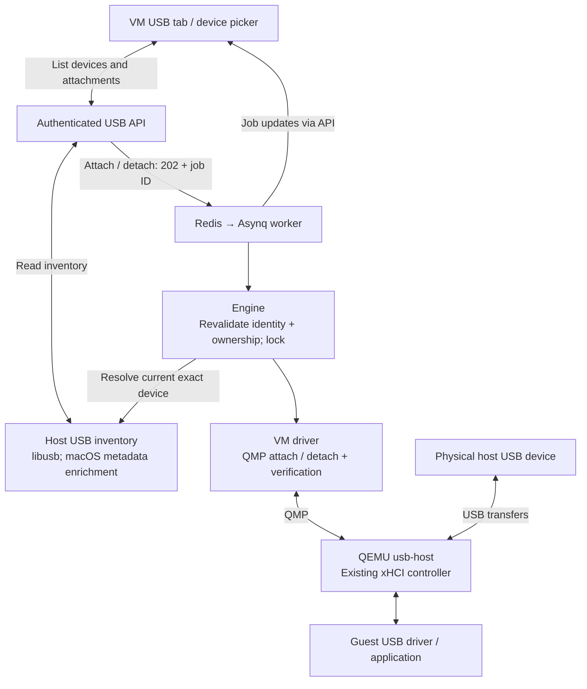

# USB passthrough implementation plan

Status: first implementation delivered, 2026-09-14; persistent manifest assignments with a deny-on-missing boot policy delivered 2026-09-14. This document records the original plan. See [USB devices](../usb.md) for implemented behavior, validation and limitations. Physical hardware acceptance remains follow-up work. Stock QEMU reconnect matching is constrained by bus/address/port and product IDs; serial/session matching is checked by maco during explicit attach, not by QEMU during automatic reconnection.

## User experience and scope

Add a **USB devices** tab to VM details. Show attached devices and an **Attach USB device** picker listing physical USB devices on the macOS server, not the browser's computer. Support live attach and detach for running VMs, with operations reported through the existing jobs UI. Start with session-only attachments: stopping the VM releases them; restart does not silently recapture them. Persistent assignments are a separate follow-up.

The picker must make the physical device identifiable:

| Field | Presentation |
| --- | --- |
| Product and manufacturer | Primary human-readable identity; show unknown explicitly |
| Device class / interfaces | Storage, serial, audio, composite, etc. |
| Vendor / product IDs | Fixed-width hexadecimal values |
| Serial number | Full value available for comparison; explicitly show unavailable |
| Physical location | Bus and port path; distinguish otherwise identical devices |
| Availability | Available, assigned to VM name, missing, unsupported, or access unknown |
| Reason | Explain why an action is disabled or failed |

Include search and refresh; refresh while the picker is open, preserving selection only while its identity is unchanged. Show the selected identity beside Attach. Never select a device from VID/PID alone. Busy/access status is best-effort until capture is attempted. Display stale or ambiguous selections as requiring reselection.

Use whole-device assignment for composite devices and explain that all interfaces move together. Hubs and internal/essential host devices should be listed with an unsupported reason when reliably identified. Never automatically unmount host storage or force-release host drivers. Storage attach errors should tell users to unmount it on the host; detach should remind them to eject/unmount inside the guest first.

## Proposed flow

USB payloads flow through QEMU directly. Passing through USB storage does not create a QCOW2 disk and bypasses maco's ordinary disk-image management.

## 1. Validate the macOS backend first

- Verified locally: `qemu-system-aarch64 -device usb-host,help` exposes `usb-host`, bus/address/port, VID/PID and serial properties. Existing `pkg/vm/qemu.go` creates `qemu-xhci`, `usb-kbd` and `usb-tablet`.
- This proves device-model availability, not successful macOS capture. Test a disposable external device on the supported macOS/QEMU combination: enumerate, capture, use in guest, release, reuse on host. Record QEMU/libusb/macOS versions and permission or host-driver limitations.
- Prefer a small `pkg/usb` inventory provider backed by libusb, so selectors use the same namespace as QEMU. Validate packaging/build implications before choosing cgo versus a small native helper. Enrich with IOKit only where useful; do not assume its location IDs equal libusb bus/port IDs.
- Probe QEMU properties and controller presence. Return a clear unsupported/restart-required result for incompatible binaries or older VMs. Give the controller a stable ID for new launches; preserve emulated keyboard/tablet support.
- If capture cannot work reliably for a device class, expose that limitation; do not claim universal USB compatibility.

## 2. Inventory, identity and ownership

- Define `HostUSBDevice` with an opaque inventory ID, generation/fingerprint, VID/PID, manufacturer, product, optional serial, class/interfaces, bus/address, port path, and availability/reason.
- Treat bus/address as transient. Resolve the selection again when the worker executes, comparing fingerprint, location and serial where available. Fail if it vanished, changed, or matches multiple devices. Do not fall back to any device of the same model.
- Define `USBAttachment` with attachment UUID, VM ID and process generation, QEMU device ID, selected identity and observed state: attaching, attached, detaching, missing, error or unknown.
- Serialize claims across VMs and local maco instances, including different data directories, using a host-level device lock/claim plus the VM lifecycle lock in a documented fixed order. Existing single-worker serialization alone is insufficient.
- Treat QEMU/runtime observations as authoritative for live ownership. Retain claims on uncertain outcomes until inspection resolves them. Rebuild/reconcile cached attachment records after backend restart against live QEMU objects and processes. Release after confirmed detach or VM exit.
- Physical unplug must update state. Avoid automatically capturing a replacement device on address reuse. Validate QEMU's reconnection matching in the spike; remove stale usb-host objects or constrain selectors sufficiently before offering the feature.

## 3. Driver and engine

- Add `pkg/vm/usb.go` for attach, detach and inspect, and `pkg/engine/usb.go` for identity validation, claim management and lifecycle integration.
- Attach with QMP `device_add`, `driver=usb-host`, an application-generated device ID, the validated controller bus and exact current host selectors. Use structured arguments, never user-supplied QMP commands.
- Verify host-device capture as well as QEMU object creation: a successful command alone may leave an object waiting for a host device. Establish a reliable observation mechanism in the spike, and surface unknown instead of claiming success without evidence.
- Detach with `device_del` and await matching `DEVICE_DELETED`, or verify absence after an interrupted connection. Extend `pkg/vm/qmp.go`: it currently discards events and does not retain event data. Preserve events arriving before command responses, correlate commands, handle unplug error events and bound all waits.
- On attach failure, remove any partially created object and release ownership only after confirmed cleanup. On timeout or backend interruption, inspect before retry; keep the existing no-automatic-retry policy for mutations.
- On VM stop/delete, reconcile ownership. Never detach maco's emulated keyboard/tablet. Reject operations against stopped VMs in this first version.

## 4. API, jobs, CLI and UI

| Route | Behavior |
| --- | --- |
| `GET /api/usb/devices` | Immediate host inventory and passthrough capability/reason |
| `GET /api/vms/{id}/usb` | Immediate observed attachment list |
| `POST /api/vms/{id}/usb` | Queue `vm.usb.attach` with inventory ID + expected fingerprint; return 202 |
| `DELETE /api/vms/{id}/usb/{attachmentId}` | Queue `vm.usb.detach`; return 202 |

Apply existing authentication and input validation. Check attachment ownership against the URL VM. Revalidate capability, identity and claim in the worker even if submission already validated them. Use stable error codes for stale selection, claimed device, host access failure, unsupported backend and uncertain detach.

Extend job payloads and dispatch in `pkg/jobs`. Expose matching synchronous CLI operations: `maco usb list`, `maco vm usb list <vm>`, `maco vm usb attach <vm> <device-id>`, `maco vm usb detach <vm> <attachment-id>`.

In the UI, show pending/running/failure states through existing job streaming, refresh inventory after completion, and keep disappearing devices visible in the attached list as missing. Two identical products must remain distinguishable by serial/location. Never report Detach complete solely because the HTTP request was accepted.

## 5. Acceptance checks

- Inventory tests: unknown descriptors, missing/duplicate serials, identical VID/PID, composite devices, disconnect/reconnect and changing addresses.
- QMP fixtures: successful attach, object present but capture failed, event before response, delayed detach, guest unplug error, timeout and uncertain cleanup.
- Engine/API tests: stale queued selection, two VMs racing for one device, cross-instance claims, stop during attach, restarted backend, unauthorized requests and wrong-VM detach.
- UI verification: search, identity readability, refresh preserving safe selection, disabled reasons, job failure and missing-device states.
- Hardware acceptance: external USB serial device and disposable USB storage, guest detection and useful I/O, clean guest eject/detach, host reuse, physical unplug and repeated cycles. Exercise two identical devices if available. Mock tests do not establish hardware support.

Deliver in order: backend feasibility evidence → inventory + read API → driver/event handling + engine ownership → jobs/API/CLI → UI picker and tab → hardware acceptance and documentation.

## Follow-up: remembered assignments (delivered)

Manifest `usb:` assignments store serial plus VID/PID, never a transient bus/address. The missing-device boot policy is deny-on-missing: `StartVM` resolves every assignment against the live inventory before launching QEMU and refuses to start when a device is missing, ambiguous, unavailable, or already claimed by another VM; after launch a failed capture stops the VM. Cross-VM conflicts reuse the existing host-level claim registry. Physical unplug leaves the VM running and marks the assignment missing. Remaining follow-up: surfacing assignment management in the web UI, and boot-policy options beyond deny-on-missing (for example start-degraded).

## References

- [QEMU USB documentation](https://www.qemu.org/docs/master/system/devices/usb.html): host passthrough selectors and controller configuration.
- [QEMU QMP device removal](https://www.qemu.org/docs/master/interop/qemu-qmp-ref.html#command-device_del): command acceptance is separate from removal completion.
- Existing implementation: `pkg/vm/qemu.go`, `pkg/vm/qmp.go`, `pkg/vm/disks.go`, `pkg/engine/vm.go`, `pkg/jobs/jobs.go`.
